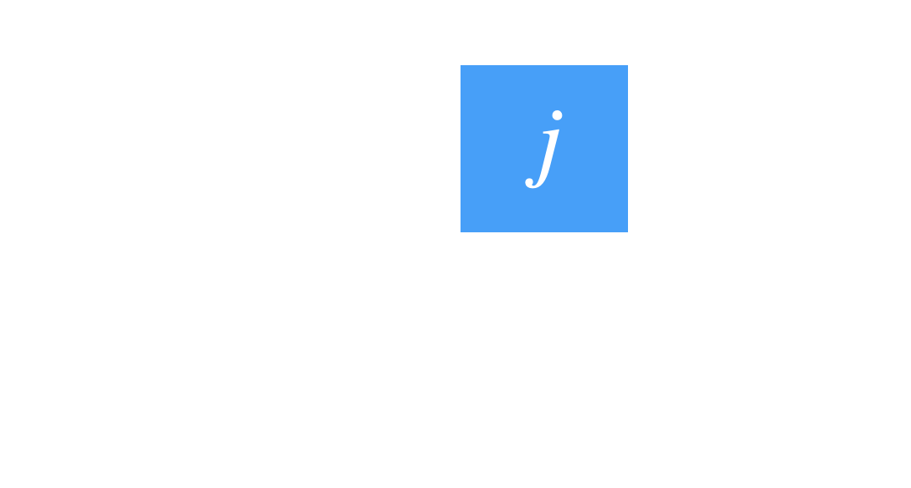
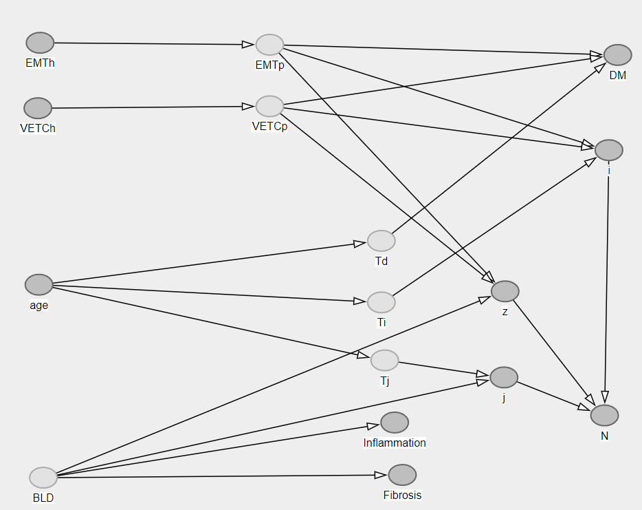
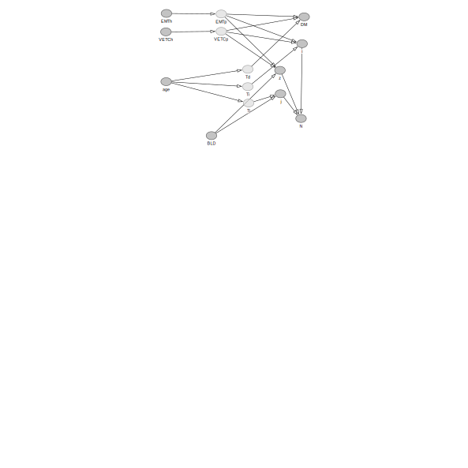

<<<<<<< HEAD
# Multifocal HCC



Given heach patient ($k$), each new clone ($j$), each non-clonal nodule ($i$), we will try to model, in the setting of Hepatocellular Carcinoma (HCC) the multifocality process. In our setting some of the nodules have been biopsied several times ($h$) and some nodule has not been biopsied but recorded ($z$). Therefore the total number of intrahepatic nodules in each patients ($N_{nod[k]}$) is the result of the sum of the maximum number nodules of each new clone ($i^{\text{max}}_j$) and the non-biopsied nodules ($z$): 

```math
N_{nod[k]} = i^{\text{max}}_{j=1} + \cdots + i^{\text{max}}_{j=j^{\text{max}}} + z
```
Therefore we can simplify with:

```math
N_{nod[k]} = \sum_{j=1}^{\text{max}(j)}i_j + z\\
```

And then model the total number of clones in each patient (max $j_{[k]}$ ) as a function of the background liver disease and its time ($f(BLD_{[k]}) + T_j$)

```math
\begin{align}
\text{max}(j_{[k]}) &= f(BLD_{[k]}) + T_j\\ 
\text{max}(i_{[j,k]}) &= f(VETC_{P[j,k]}) + f(EMT_{P[j,k]}) + T_i \\
VETC_{P[j,k]} &= f(VETC_{[h,i,j,k]}) \\
EMT_{P[j,k]} &= f(EMT_{[h,i,j,k]}) \\
z &= f(EMT_{P[j,k]}) + f(VETC_{P[j,k]}) \\
DM &= f(VETC_{P[j,k]}) + f(EMT_{P[j,k]}) + T_d \\
T_j &= f(age) \\ 
T_i &= f(age) \\
T_d &= f(age)
\end{align}
```



<a rel="license" href="http://creativecommons.org/licenses/by/4.0/"></a><br />This work is licensed under a <a rel="license" href="http://creativecommons.org/licenses/by/4.0/">Creative Commons Attribution 4.0 International License</a>.
=======
# Multifocal HCC


Given heach patient ($k$), each new clone ($j$), each non-clonal nodule ($i$), we will try to model, in the setting of Hepatocellular Carcinoma (HCC) the multifocality process. In our setting some of the nodules have been biopsied several times ($h$) and some nodule has not been biopsied but recorded ($z$). Therefore the total number of intrahepatic nodules in each patients ($N_{nod[k]}$) is the result of the sum of the maximum number nodules of each new clone ($i^{\text{max}}_j$) and the non-biopsied nodules ($z$): 

```math
N_{nod[k]} = i^{\text{max}}_{j=1} + \cdots + i^{\text{max}}_{j=j^{\text{max}}} + z
```
Therefore we can simplify with:

```math
N_{nod[k]} = \sum_{j=1}^{\text{max}(j)}i_j + z\\
```

And then model the total number of clones in each patient (max $j_{[k]}$ ) as a function of the background liver disease and its time ($f(BLD_{[k]}) + T_j$)

```math
\begin{align}
\text{max}(j_{[k]}) &= f(BLD_{[k]}) + T_j\\ 
\text{max}(i_{[j,k]}) &= f(VETC_{P[j,k]}) + f(EMT_{P[j,k]}) + T_i \\
VETC_{P[j,k]} &= f(VETC_{[h,i,j,k]}) \\
EMT_{P[j,k]} &= f(EMT_{[h,i,j,k]}) \\
z &= f(EMT_{P[j,k]}) + f(VETC_{P[j,k]}) \\
DM &= f(VETC_{P[j,k]}) + f(EMT_{P[j,k]}) + T_d \\
T_j &= f(age) \\ 
T_i &= f(age) \\
T_d &= f(age)
\end{align}
```

>>>>>>> cceb06f (sync)
